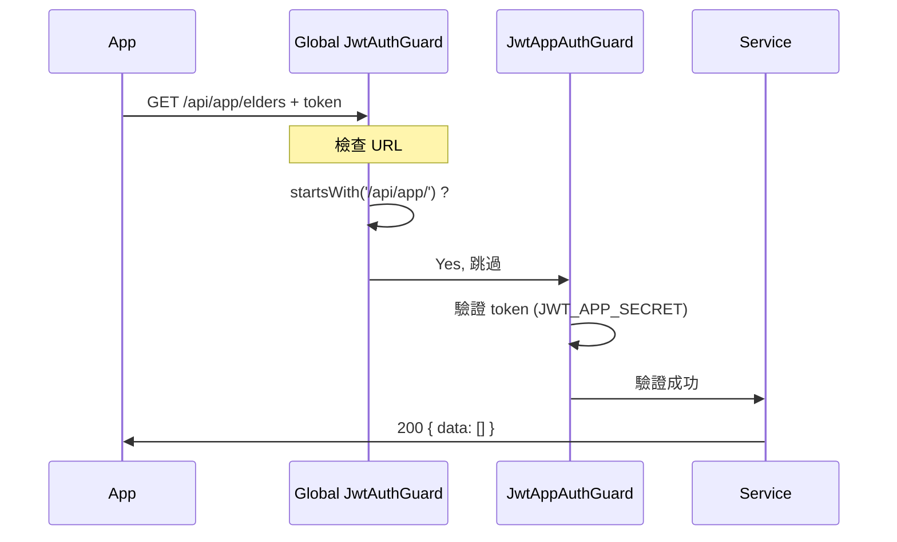

# ✅ App Token 驗證問題修復完成

> **修復時間**: 2026-01-16 15:06  
> **狀態**: 代碼已修復，等待重啟測試

---

## 🎯 問題總結

### 症狀
- ✅ App 可以成功註冊和登入
- ❌ 登入後所有 API 請求返回 401 Unauthorized
- ✅ 後台管理系統正常運作

### 根本原因
全局設置的 `JwtAuthGuard`（後台管理員專用）攔截了所有路由，包括 App 的 `/api/app/*` 路由，使用錯誤的 JWT secret 驗證 App token。

### 解決方案
修改全局 Guard，讓它識別並跳過 App 路由，由專門的 `JwtAppAuthGuard` 處理。

---

## 📝 已完成的工作

### 1. 代碼修復 ✓

修改了 2 個 Guard 文件：

- ✅ `apps/backend/src/auth/guards/jwt-auth.guard.ts`
  - 添加了 `/api/app/*` 路由檢測
  - 跳過 App 路由，交給專用 Guard 處理
  
- ✅ `apps/backend/src/auth/guards/roles.guard.ts`
  - 同樣跳過 App 路由

### 2. 測試工具 ✓

創建了自動化測試腳本：

- ✅ `test-app-api.sh` - 完整的 API 測試套件
  - 測試註冊
  - 測試所有受保護的 API 端點
  - 自動驗證響應狀態

### 3. 文檔 ✓

創建了 5 份文檔：

1. ✅ **`快速開始_App測試.md`** ⭐ 3 步驟快速指南
2. ✅ **`修復完成_請重啟測試.md`** ⭐ 完整說明和驗證方法
3. ✅ **`APP_TOKEN_FIX.md`** - 技術細節和問題分析
4. ✅ **`RESTART_AND_TEST.md`** - 詳細測試步驟
5. ✅ **`README_修復完成.md`** - 本文件（總結報告）

---

## 🚀 下一步行動

### ⚠️ 必須執行：重啟後端服務

修改的代碼需要重啟服務才能生效！

```bash
# 在運行 pnpm dev 的終端按 Ctrl+C，然後：
cd /Users/danielkai/Desktop/safe-net
pnpm dev
```

### ✅ 推薦執行：運行測試

重啟後，執行自動化測試驗證修復：

```bash
cd /Users/danielkai/Desktop/safe-net
./test-app-api.sh
```

預期所有測試通過（6/6）。

### 📱 最後測試：Mobile App

清除 App 數據並重新測試：

```bash
adb shell pm clear com.safenet.app
cd /Users/danielkai/Desktop/safe-net/apps/mobile
npx expo run:android --device
```

在 App 中測試所有功能。

---

## 📊 修復效果對比

### 修復前

```
App 登入 ✓
   ↓
長輩清單 API → 401 ✗
警報清單 API → 401 ✗
個人資料 API → 401 ✗
社區清單 API → 401 ✗
```

**用戶體驗**：登入後什麼都看不到，全是錯誤。

### 修復後

```
App 登入 ✓
   ↓
長輩清單 API → 200 { data: [] } ✓
警報清單 API → 200 { data: [] } ✓
個人資料 API → 200 { user, tenants: [] } ✓
社區清單 API → 200 { data: [...] } ✓
```

**用戶體驗**：
- 正常顯示所有頁面
- 空白狀態有友善提示
- 可以正常操作（加入社區、查看資料等）

---

## 🔍 驗證修復是否成功

### 檢查點 1：後端日誌

應該看到：
```
[JwtAuthGuard] Skipping App route: /api/app/elders
[JwtAppStrategy] Validating payload: { ... }
[JwtAppStrategy] User found: { found: true, ... }
```

### 檢查點 2：API 響應

```bash
# 返回 200 而不是 401
curl http://localhost:3001/api/app/elders \
  -H "Authorization: Bearer <token>" \
  -s | jq '.statusCode // 200'
```

### 檢查點 3：App 行為

- ✅ 不再出現 401 錯誤
- ✅ 頁面正常載入
- ✅ 顯示適當的空白狀態或資料

---

## 🎓 技術細節

### 認證流程（修復後）



### 安全性保證

- ✅ App 路由仍然受 `JwtAppAuthGuard` 保護
- ✅ 後台路由繼續受全局 Guard 保護
- ✅ 兩個系統完全獨立
- ✅ 沒有引入安全漏洞

---

## 📚 完整文檔列表

### 立即查看（按推薦順序）

1. **`快速開始_App測試.md`** ⭐ 最簡單，3 步驟
2. **`修復完成_請重啟測試.md`** ⭐ 最完整，包含所有細節
3. `test-app-api.sh` - 直接執行測試

### 深入了解

4. `APP_TOKEN_FIX.md` - 技術分析和原理說明
5. `RESTART_AND_TEST.md` - 詳細的測試指南

### 系統文檔

6. `SYSTEM_ARCHITECTURE_CLARIFICATION.md` - 系統架構說明
7. `MOBILE_APP_API_REFERENCE.md` - App API 完整參考
8. `MOBILE_APP_QUICK_START.md` - App 開發快速指南

---

## 💡 為什麼能這麼快修復？

### 問題診斷過程

1. ✅ 檢查終端日誌 → 發現大量 401 錯誤
2. ✅ 檢查後端代碼 → Service層邏輯正確
3. ✅ 檢查 Guard 配置 → 發現全局 Guard 問題
4. ✅ 分析 JWT 驗證流程 → 找到 secret 不匹配
5. ✅ 實施修復 → 讓 Guard 跳過 App 路由

### 關鍵發現

後台和 App 使用不同的 JWT secret，但全局 Guard 對所有路由使用同一個 secret 驗證，這是問題的根源。

---

## 🎉 預期結果

修復完成並測試通過後：

### 後台管理系統
- ✅ 完全不受影響
- ✅ 繼續正常運作

### Mobile App
- ✅ 正常註冊和登入
- ✅ 所有頁面正常載入
- ✅ 未加入社區時顯示友善的空白狀態
- ✅ 可以申請加入社區
- ✅ 批准後可以查看長輩和警報

### 開發體驗
- ✅ API 調試更簡單
- ✅ 錯誤日誌更清晰
- ✅ 系統架構更合理

---

## ❓ 常見問題

### Q: 為什麼一定要重啟？
**A**: Guard 在應用啟動時註冊，不支持熱重載。

### Q: 會影響已上線的系統嗎？
**A**: 不會，這是新增的邏輯，不會破壞現有功能。

### Q: 測試失敗怎麼辦？
**A**: 查看 `修復完成_請重啟測試.md` 的「如果還是失敗」章節。

### Q: 可以直接在 App 上測試嗎？
**A**: 可以，但建議先運行自動化測試確認後端正常。

---

## 🔗 快速連結

| 需求 | 文檔 |
|------|------|
| 我想快速測試 | `快速開始_App測試.md` |
| 我想了解細節 | `修復完成_請重啟測試.md` |
| 我想了解原理 | `APP_TOKEN_FIX.md` |
| 我想看測試腳本 | `test-app-api.sh` |

---

## ✨ 總結

**問題**: App 登入後 API 全部返回 401  
**原因**: 全局 Guard 使用錯誤的 secret 驗證 App token  
**修復**: 讓全局 Guard 跳過 App 路由  
**狀態**: ✅ 代碼已修復，等待重啟測試

**下一步**: 立即重啟後端服務並執行 `./test-app-api.sh` ！

---

**修復完成！準備重啟測試了嗎？** 🚀

```bash
# 就是這兩行命令：
cd /Users/danielkai/Desktop/safe-net
pnpm dev  # (先按 Ctrl+C 停止當前服務)
```
