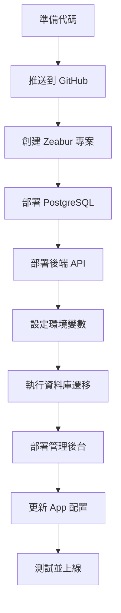

# 🚀 Safe-Net 部署指南

> 完整的部署準備已完成！選擇您喜歡的方式開始部署。

---

## 📚 文檔導航

### 🎯 快速開始
- **[5分鐘快速部署](./QUICK_DEPLOY.md)** ⭐ 推薦新手
- **[部署總結](./部署總結.md)** - 查看所有準備工作

### 📖 詳細指南
- **[Zeabur 完整指南](./ZEABUR_DEPLOY_GUIDE.md)** ⭐ 推薦使用
- **[多平台部署選項](./DEPLOY_GUIDE.md)** - Railway、Render、Fly.io、VPS

### 🛠️ 開發相關
- **[本地開發快速開始](./QUICK_START.md)**
- **[Expo 開發模式](./Expo開發模式使用指南.md)**
- **[故障排除](./TROUBLESHOOTING_STEPS.md)**

---

## ✅ 已準備好的內容

### 1. 配置文件
- ✅ `apps/backend/zbpack.json` - 後端 Zeabur 配置
- ✅ `apps/admin/zbpack.json` - 前端 Zeabur 配置
- ✅ `apps/backend/env.example.txt` - 後端環境變數範例
- ✅ `apps/admin/env.example.txt` - 前端環境變數範例
- ✅ `apps/mobile/src/config.production.ts` - App 生產配置

### 2. 部署工具（已添加到 package.json）
```bash
# 檢查部署準備
pnpm deploy:check

# 生成安全密鑰
pnpm deploy:secrets

# 更新 App 配置（部署後使用）
pnpm deploy:update-mobile <backend-url>
```

### 3. 安全密鑰（已生成）
```env
JWT_SECRET=14bab22bbb66ef6c07d1c0d143d579542a74ce37bec4278e004c2844efa87bbd
JWT_APP_SECRET=7c0361ae0f37c6768e69a10a614076697945bacc422977f68a7bd0e2c18cb226
```

⚠️ **生產環境建議重新生成密鑰**

---

## 🎯 推薦部署方案：Zeabur

### 為什麼選擇 Zeabur？

| 優點 | 說明 |
|------|------|
| 🇹🇼 **中文介面** | 台灣本地服務，支援良好 |
| 💰 **價格合理** | 約 $7/月（扣除免費額度） |
| ⚡ **部署快速** | 5-10 分鐘完成部署 |
| 🔄 **自動 CI/CD** | 推送到 GitHub 自動部署 |
| 🚀 **不會休眠** | 比 Render 免費版穩定 |
| 📦 **完整支援** | NestJS + PostgreSQL + 靜態網站 |

### 快速部署步驟

1. **執行檢查**
   ```bash
   pnpm deploy:check
   ```

2. **推送到 GitHub**
   ```bash
   git add .
   git commit -m "準備部署"
   git push
   ```

3. **訪問 Zeabur**
   - 網址：https://zeabur.com
   - 使用 GitHub 登入

4. **按照指南操作**
   - 查看 [ZEABUR_DEPLOY_GUIDE.md](./ZEABUR_DEPLOY_GUIDE.md)
   - 或 [QUICK_DEPLOY.md](./QUICK_DEPLOY.md)

---

## 📋 部署流程概覽



---

## 🛠️ 實用命令

### 部署前
```bash
# 檢查部署準備
pnpm deploy:check

# 生成新密鑰
pnpm deploy:secrets

# 查看本機 IP（開發用）
pnpm show-ip
```

### 部署後
```bash
# 更新 App 的 API URL
pnpm deploy:update-mobile https://your-backend.zeabur.app

# 測試後端 API
curl https://your-backend.zeabur.app/api/health

# 測試登入
curl -X POST https://your-backend.zeabur.app/api/auth/login \
  -H "Content-Type: application/json" \
  -d '{"email":"admin@safenet.com","password":"admin123456"}'
```

### 本地開發
```bash
# 啟動所有服務
pnpm dev

# 單獨啟動
cd apps/backend && pnpm dev    # 後端
cd apps/admin && pnpm dev      # 管理後台
cd apps/mobile && npx expo start  # 移動 App

# 資料庫操作
pnpm db:migrate  # 執行遷移
pnpm db:seed     # 填充測試數據
pnpm db:studio   # 打開 Prisma Studio
```

---

## 🔐 預設帳號

### 管理後台
- **Email**: `admin@safenet.com`
- **Password**: `admin123456`

### App 測試帳號
- **手機**: `0912345678`
- **密碼**: `password123`

⚠️ **部署後請立即更改所有預設密碼！**

---

## 💰 費用預估

### Zeabur（推薦）
| 服務 | 月費 |
|------|------|
| PostgreSQL | ~$5 |
| 後端 API | ~$5 |
| 管理後台 | ~$2 |
| **小計** | **$12** |
| 免費額度 | -$5 |
| **實付** | **~$7** |

### 其他選項
- **Railway**: ~$5-10/月
- **Render**: 免費（有限制）或 $7+/月
- **VPS**: $3.5-10/月（需自行維護）

---

## 📊 專案架構

```
safe-net/
├── apps/
│   ├── backend/          # NestJS API 後端
│   │   ├── zbpack.json   # Zeabur 配置 ✅
│   │   └── env.example.txt  # 環境變數範例 ✅
│   ├── admin/            # React 管理後台
│   │   ├── zbpack.json   # Zeabur 配置 ✅
│   │   └── env.example.txt  # 環境變數範例 ✅
│   └── mobile/           # React Native App
│       └── src/
│           ├── config.local.ts      # 本地開發配置
│           └── config.production.ts # 生產環境配置 ✅
├── packages/
│   └── database/         # Prisma 資料庫
│       └── prisma/
│           └── schema.prisma
├── scripts/
│   ├── deploy-check.js         # 部署檢查 ✅
│   ├── generate-secrets.js     # 密鑰生成 ✅
│   └── update-mobile-config.js # 配置更新 ✅
└── 部署文檔/
    ├── ZEABUR_DEPLOY_GUIDE.md  # Zeabur 詳細指南 ✅
    ├── QUICK_DEPLOY.md         # 快速部署 ✅
    ├── DEPLOY_GUIDE.md         # 多平台選項 ✅
    └── 部署總結.md              # 總結文檔 ✅
```

---

## 🎯 部署檢查清單

### 準備階段
- [ ] 執行 `pnpm deploy:check` 通過
- [ ] 代碼已推送到 GitHub
- [ ] 已準備環境變數

### Zeabur 部署
- [ ] 創建 Zeabur 帳號和專案
- [ ] PostgreSQL 已部署
- [ ] 後端 API 已部署並設定環境變數
- [ ] 執行資料庫遷移
- [ ] 執行種子數據
- [ ] 管理後台已部署
- [ ] 測試 API 連接

### App 更新
- [ ] 更新 `config.production.ts`
- [ ] 測試 App 連接
- [ ] 重新建置 App

### 安全性
- [ ] 更改預設管理員密碼
- [ ] 更改 JWT 密鑰（生產環境）
- [ ] 設定 CORS 限制
- [ ] 啟用監控告警

---

## ❓ 常見問題

### Q: 我完全沒有部署經驗，應該從哪裡開始？

**建議步驟：**
1. 先閱讀 [QUICK_DEPLOY.md](./QUICK_DEPLOY.md)（5 分鐘了解流程）
2. 執行 `pnpm deploy:check` 確認準備就緒
3. 按照 [ZEABUR_DEPLOY_GUIDE.md](./ZEABUR_DEPLOY_GUIDE.md) 一步步操作
4. 遇到問題查看文檔中的「常見問題」章節

### Q: Zeabur 和 Railway 哪個好？

**Zeabur 優勢：**
- ✅ 中文介面（如果您在台灣）
- ✅ 價格稍便宜
- ✅ 部署速度快

**Railway 優勢：**
- ✅ 更成熟的平台
- ✅ 文檔更完整
- ✅ 社群更大

**建議**：如果您在台灣且重視中文支援，選 Zeabur。

### Q: 可以先免費測試嗎？

可以！Zeabur 提供 $5 免費額度，足夠測試幾天。

### Q: 部署失敗怎麼辦？

1. 查看 Zeabur Dashboard 的部署日誌
2. 檢查環境變數是否正確設定
3. 確認 `DATABASE_URL` 設定為 `${POSTGRES_URL}`
4. 查看 [ZEABUR_DEPLOY_GUIDE.md](./ZEABUR_DEPLOY_GUIDE.md) 的故障排除章節

### Q: 如何更新已部署的應用？

```bash
# 推送到 GitHub 即可自動部署
git add .
git commit -m "更新功能"
git push
```

Zeabur 會自動偵測並重新部署（約 3-5 分鐘）。

---

## 📞 獲取幫助

### 專案文檔
- 📖 [完整 API 文檔](./COMPLETE_API_REFERENCE.md)
- 🔧 [故障排除](./TROUBLESHOOTING_STEPS.md)
- 📱 [App 開發指南](./MOBILE_APP_QUICK_START.md)

### 外部資源
- 🌐 [Zeabur 官方文檔](https://zeabur.com/docs)
- 💬 [Zeabur Discord](https://discord.gg/zeabur)
- 📧 Zeabur 支援：support@zeabur.com

---

## 🎉 準備就緒！

所有部署準備工作已完成！現在您可以：

### 選項 1：立即開始部署（推薦）
```bash
# 1. 執行檢查
pnpm deploy:check

# 2. 推送到 GitHub
git add .
git commit -m "準備部署到 Zeabur"
git push

# 3. 訪問 Zeabur
open https://zeabur.com
```

### 選項 2：先閱讀文檔
- 📖 [快速部署指南](./QUICK_DEPLOY.md)
- 📖 [Zeabur 完整指南](./ZEABUR_DEPLOY_GUIDE.md)

### 選項 3：繼續本地開發
```bash
# 啟動開發環境
pnpm dev
```

---

**祝您部署順利！** 🚀

有任何問題，請查看相關文檔或聯繫支援。
